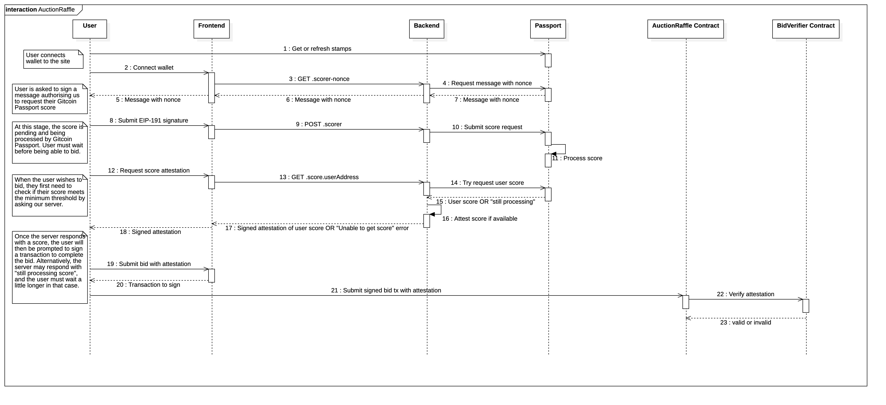

# Contracts

## High-level Overview

`AuctionRaffle.sol` is a combined auction and raffle system for Devcon ticket sales. At a high level, the contract progresses through the following phases.

1. Initial phase: This is the initial state of the contract, before bidding starts.

2. Bidding phase: When bidding opens after a configurable timestamp, the contract accepts bids from eligible wallets through the `bid` function. Alternatively, eligible wallets may also increase their existing bids using the `bump` function. The eligibility of a wallet is verified by an attestation mechanism that is hosted by the operator (see `contracts/verifier/ScoreAttestationVerifier.sol`). For Devcon 7, eligibility is determined by a Gitcoin passport score (also, see the [Gitcoin Passport Score Attestation](#gitcoin-passport-score-attestation) section below).

3. Auction phase: After the bidding period has ended, the operator settles the auction by calling the `settleAuction` function, which determines the auction winners (the number of auction winners is configurable).

4. Raffle phase: After the auction has settled, the operator begins the raffling phase by requesting a verifiable random number from Chainlink VRF. When the random number is delivered to the contract, the raffle winners are determined. The raffle winners are lazily evaluated using a Feistel shuffle to minimise gas usage (see: [Improving the Devcon Raffle](https://docs.fairy.dev/case-studies/improving-the-devcon-raffle)).

5. Claim phase: After the raffle has settled, some participants may withdraw none, some, or all of their bid amounts depending on the outcome of the Auction Raffle.

- Auction winners are not entitled to claim any amount.
- The first raffle winner is the lucky winner of the _golden ticket_ and may use the `claim` function to withdraw their full bid amount.
- All other raffle winners may withdraw their bid amount minus the reserve price.
- Losers may withdraw their full bid amount (there was previously a non-refundable 2% fee, but that has now been removed).

## Gitcoin Passport Score Attestation

For this 2024's edition of Devcon, users must have possess a minimum score on Gitcoin Passport in order to bid for a ticket. The `frontend` package in this repository has a backend component that queries the Gitcoin Passport API and returns signed attestations that users must include with their bids. A sequence diagram of this attestation flow is supplied below.



## Running Hardhat node

Change directory to `packages/contracts` and execute:

```shell
pnpm node:run
```

This will start a Hardhat node, deploy the contracts and place initial bids using the first twenty auto-generated accounts.

## Custom tasks

A number of custom Hardhat tasks were defined to aid testing.

### Managing local node

- `pnpm node:increase-time [--value <INT>]` - increase block time by _value_ seconds, defaults to six hour
- `pnpm node:accounts` - print a list of available accounts

### Interacting with AuctionRaffle contract

#### Hardhat

- `pnpm hardhat:bid --account <STRING> --amount <STRING>` - using _account_ place bid of _amount_ ETH
- `pnpm hardhat:bid-random --amount <INT> [--account <INT>]` - using randomly generated accounts place _amount_ of bids using funds from account with index _account_ (defaults to `0`)
- `pnpm hardhat:settle-auction` - settle auction
- `pnpm hardhat:settle-raffle` - settle raffle using random numbers
- `pnpm hardhat:settle` - increase time, settle auction and raffle

#### Arbitrum Rinkeby

- `pnpm rinkeby:generate-dotenv [--path <STRING>] [--count <INT>]` - generate .env file needed for other tasks, _path_ - output path, _count_ - number of private keys to generate
- `pnpm rinkeby:transfer-ether` - transfer ether from `DEPLOYER` to `PRIVATE_KEYS` accounts
- `pnpm rinkeby:init-bids` - place initial bids using `PRIVATE_KEYS` accounts

#### Ethereum Mainnet

- `pnpm ethereum:generate-random-numbers --blocks <ARRAY> --secret <STRING>` - generate random numbers for raffle settlement, _blocks_ - array of block numbers from which extract block hash (e.g. "[1234, 5678]"), _secret_ - secret number represented as 32 bytes hex string
